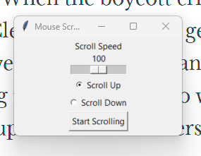

# Mouse Scroll Control

## Overview
This program allows you to control mouse scrolling using a simple Tkinter GUI. You can adjust the scroll speed and choose the scroll direction (up or down). 

## Features
- **Scroll Speed**: Adjust the speed of scrolling with a slider.
- **Scroll Direction**: Choose to scroll up or down with radio buttons.
- **Start/Stop Scrolling**: Easily start and stop scrolling with a button.

## How It Works
1. **Set Speed**: Use the slider to set how fast you want to scroll.
2. **Choose Direction**: Select either "Scroll Up" or "Scroll Down."
3. **Start Scrolling**: Click the button to begin scrolling. Click again to stop.

## Benefits
I used this program to help me read my online APUSH book. The automatic scrolling made it easier to read without having to manually scroll down every time. It saved me time and helped me focus on the content.

## Requirements
- Python
- Tkinter library
- PyAutoGUI library

## Running the Program
1. Install the required libraries if you haven't already.
2. Run the script.
3. Adjust the settings in the GUI as needed.

Enjoy easier reading!
